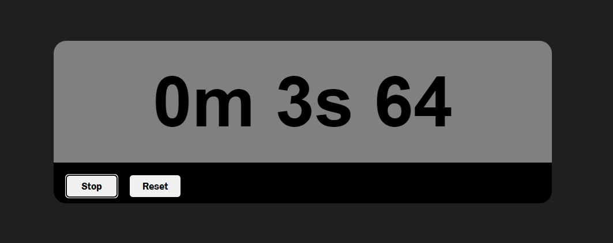

# ⏱️ Simple Stopwatch

A sleek and user-friendly stopwatch application built with HTML, CSS, and JavaScript. Track your time with precision and ease.

<p align="center">
  
</p>

## Features

- **Start/Stop:** Begin or halt the timer with a single click.
- **Reset:** Quickly reset the stopwatch to zero.
- **Lap Times:** Record multiple lap times for better tracking.

## Technologies Used


## Demo

Check out the live demo of the Stopwatch [here](https://your-demo-url.com).

## Getting Started

To get a local copy up and running, follow these simple steps:

### Prerequisites

- Clone the repository:
  ```bash
  git clone https://github.com/your-username/stopwatch.git
